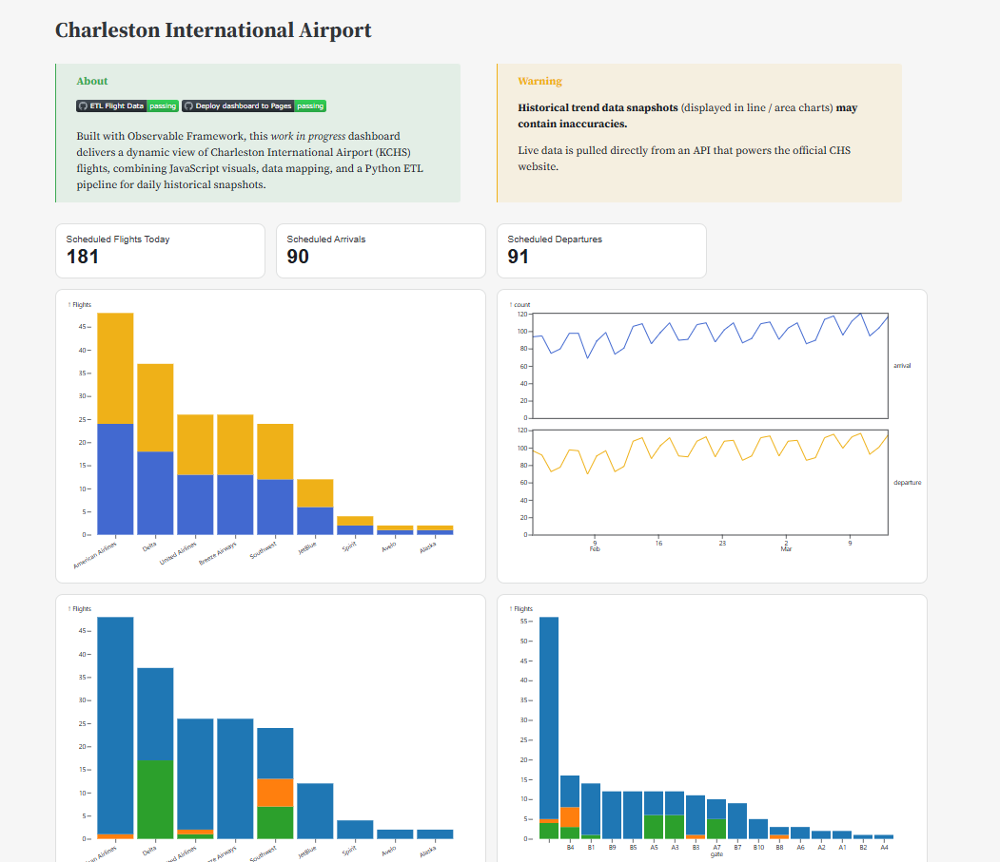

# Charleston Flights Dashboard

::: {.grid}

::: {.g-col-12}

Charleston Flights Dashboard is a work-in-progress project built with Observable Framework, combining JavaScript visuals, data mapping, and a Python ETL pipeline to provide a dynamic view of Charleston International Airport (CHS) flights. This dashboard delivers historical trends, live flight data, and interactive visualizations to help track airport operations more clearly.

<a href="https://kchs.fordjohnson.dev/" class="brand-button-primary" role="button">View the dashboard</a> <a href="https://github.com/bradfordjohnson/kchs" class="brand-button-secondary" role="button">Check out the code</a>

{width=auto}

:::

:::

## About

I'm passionate about aviation and data, and this project represents my effort to bring greater clarity to CHS flight operations through data-driven insights. In January 2025, a snowstorm temporarily shut down the airfield[^1], and the official CHS website's updates on airport operations highlighted an opportunity for additional clarity[^2]. This dashboard is designed to offer a transparent, data-focused view of CHS flights, enabling users to explore operational trends and stay informed.

[^1]: Read [CHS’s official updates](https://www.iflychs.com/airport-operations-update-winter-weather-98adda437da02bbf) on the snowstorm.
[^2]: See [CHS's Facebook Post](https://www.facebook.com/iflyCHS/posts/update-4-snow-doubt-about-itour-chs-team-is-hard-at-work-clearing-the-runways-to/1022883993204310/) and reactions from individuals during the snowstorm event.

## Approach

- **Data:** The dashboard ingests daily CHS flight data through a Python-based ETL pipeline, storing structured snapshots for historical trend analysis.
- **Tools:** Built with Observable Framework, leveraging Observable Plot, D3, and Leaflet for interactive visualizations and Python for ETL.
- **Process:** Live data is pulled directly from an API powering the official CHS website, while historical trend snapshots help identify operational patterns.

## Challenges

Working with flight data comes with its own complexities, real-world data can be messy, and structuring it for an interactive dashboard requires careful planning. I had a solid understanding of how to transform the data using SQL or Python, but implementing those transformations in JavaScript in a way that remains flexible and scalable was a new challenge. Through multiple iterations, I refined the data model to better capture flight status, delays, and trends.

Some key challenges included:

- Adapting my familiar data transformation techniques to JavaScript's unique paradigms for handling interactive, event-driven data.
- Defining and categorizing cancellations, diversions, and delays in a way that accurately represents real-world operations.
- The tedious and manual process of mapping SVG coordinates to make it appear as though planes are actually parked at the gates, this was a surprisingly time-consuming but rewarding task!

## Learning & Future Development

This project is expanding my JavaScript skills, particularly in building data-driven applications. I’m focusing on:

- [**Observable Framework**](https://observablehq.com/framework/) for developing interactive, data-powered static sites.
- D3 and Observable Plot for creating dynamic, custom visualizations.
- Leaflet for mapping and visualizing airport gate activity.
- Optimizing data workflows in JavaScript and Python to efficiently handle both real-time and historical data.

## Links

Check out the [live dashboard](https://kchs.fordjohnson.dev/) and explore the [data pipeline + dashboard code](https://github.com/bradfordjohnson/kchs).
