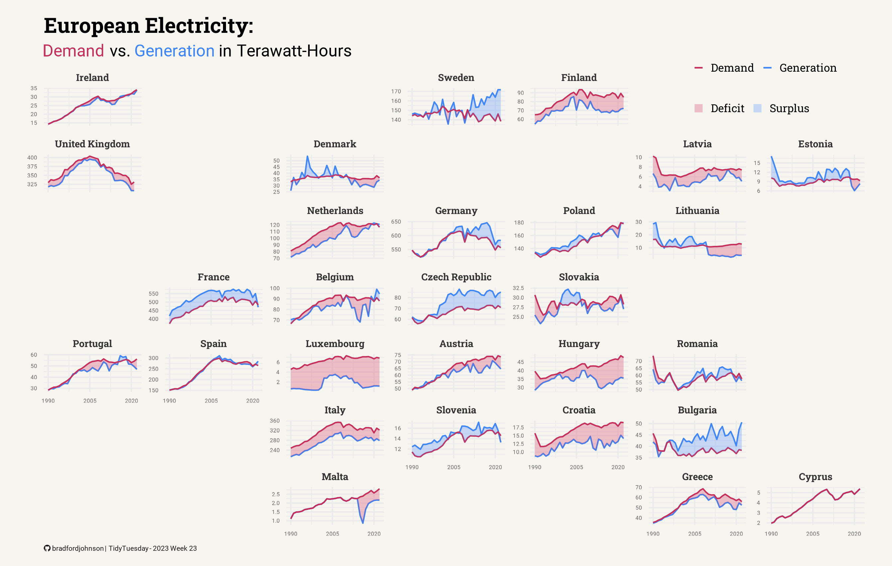

# TidyTuesday

::: {.grid}

::: {.g-col-12}
[TidyTuesday](https://tidytues.day/) is a weekly social data project in the R community, where participants explore real-world datasets, create compelling visualizations, and refine their data storytelling skills.

<a href="https://tidytuesday.fordjohnson.dev" class="brand-button-primary" role="button">View my gallery</a> <a href="https://github.com/bradfordjohnson/tidytuesday" class="brand-button-secondary" role="button">Check out the code</a>

{width=auto}

:::

:::

## About

I started participating in **2023**, drawn to the open-ended nature of the challenge and the opportunity to learn from others. Over time, TidyTuesday has become a space for me to experiment with new visualization techniques, improve my data wrangling workflow, and engage with the broader R and data visualization community.

Beyond creating visuals, I’ve also submitted datasets and connected with other data professionals. This lets praticipants gain inspiration from eachother, share insights; allowing myself to refine my own style each week. While I aim to participate regularly, I prioritize quality over quantity, choosing weeks that challenge me and help me grow when time allows.

## Approach
- **Data:** Weekly datasets from the TidyTuesday GitHub repository, covering diverse topics. Each project starts with exploratory analysis and data cleaning.
- **Tools:** Built primarily with **R**, **Quarto**, and the **Tidyverse**. I also leverage additional R packages and techniques depending on the dataset and visualization goals.
- **Process:** Each dataset is an opportunity to test new techniques, work with different data structures, and develop engaging visuals. My workflow includes data wrangling, exploratory analysis, and storytelling through visualization.

## See More

You can explore my TidyTuesday gallery [here](https://tidytuesday.fordjohnson.dev) and watch the R visual creation process [here](https://tidytuesday.fordjohnson.dev/about/) through a series of animated GIFs showcasing the step-by-step development of my ggplots.