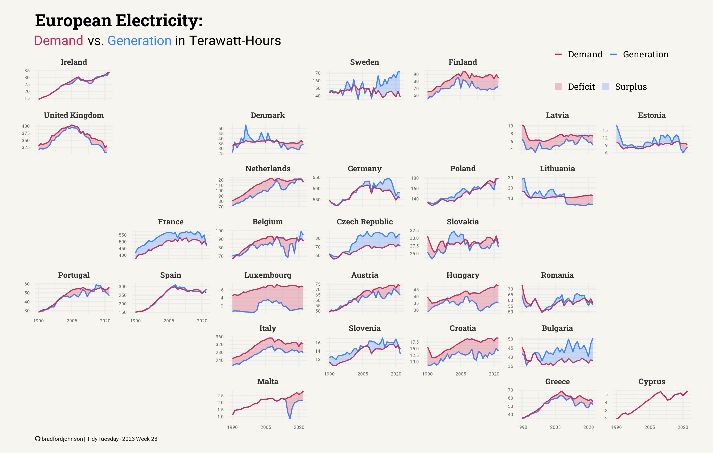

# Data to insights, visually driven.

I turn complex, messy data into clear, actionable solutions. From insightful analyses to tools and products that make decision-making easier.

<a href="#portfolio" class="btn btn-primary" role="button">View my work</a>
<a href="#contact" class="btn btn-secondary" role="button">Contact me</a>

### Highlights

- 5+ years applying analytics across business, product, and research.
- Full-stack data skills: SQL, Python, GCP, R, Looker, Excel/Sheets, and more.
- Delivering dashboards, reports, and data-driven tools from insights to action.
- Cross-functional collaboration with marketing, ops, and product teams.

### About me

I’m Bradford Johnson, a data analyst who bridges the gap between raw numbers and real-world results. Over the past five years, I’ve delivered projects ranging from deep-dive analyses to full-scale tools and products, always with one goal in mind: making data work for people.

I thrive on solving messy problems, collaborating with diverse teams, and finding the patterns that spark better decisions. When I’m not working with SQL, Python, or BI tools, you might find me exploring local coffee spots or trying to perfect my homemade pizza dough.

### Portfolio

(These can be short now, then link to full case studies.)

- Project A: Automated sales performance dashboard that cut reporting time by 80%.
- Project B: Predictive model for customer churn, improving retention strategy.
- Project C: Process optimization tool that reduced operational bottlenecks by 30%.

### Contact

#### Headline: Let’s turn your data into results.

Buttons / Links:

- Primary: Get in Touch → Contact form or mailto link
- Secondary: LinkedIn, GitHub, Resume

Whether you need a deep-dive analysis, a decision-ready dashboard, or a custom data product, I can help bring clarity to your numbers. Let’s connect and explore how we can work together.

